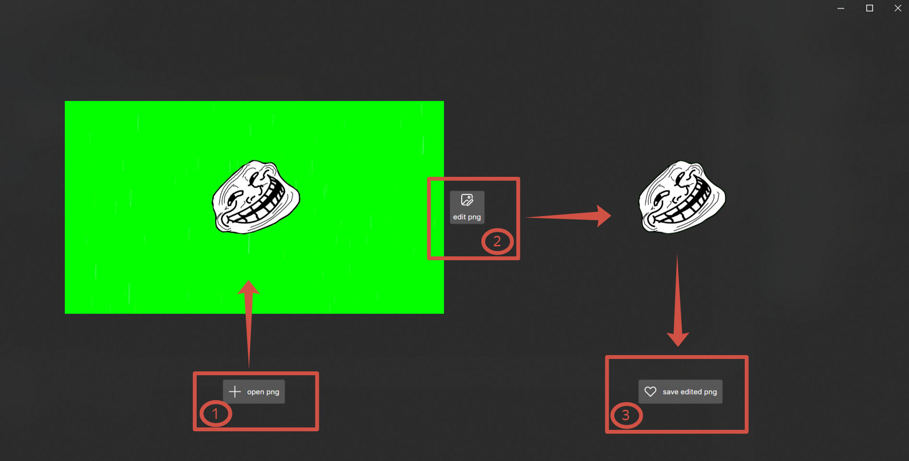

# Keyer
Replaces the green screen background of the image with a transparent
- a cross-platform solution based on ***Avalonia Ui***

the results of the program can be viewed at the link:
https://drive.google.com/drive/folders/12EJ-3O3tLlhqoK3TJeFylg8qzKWaxWVN?usp=sharing

---

---

1. **Click Button 1** select an image from your PC's hard drive.
1. **Click Button 2** to replace keing with transparency.
1. **Click Button 3** to save the processed image.
